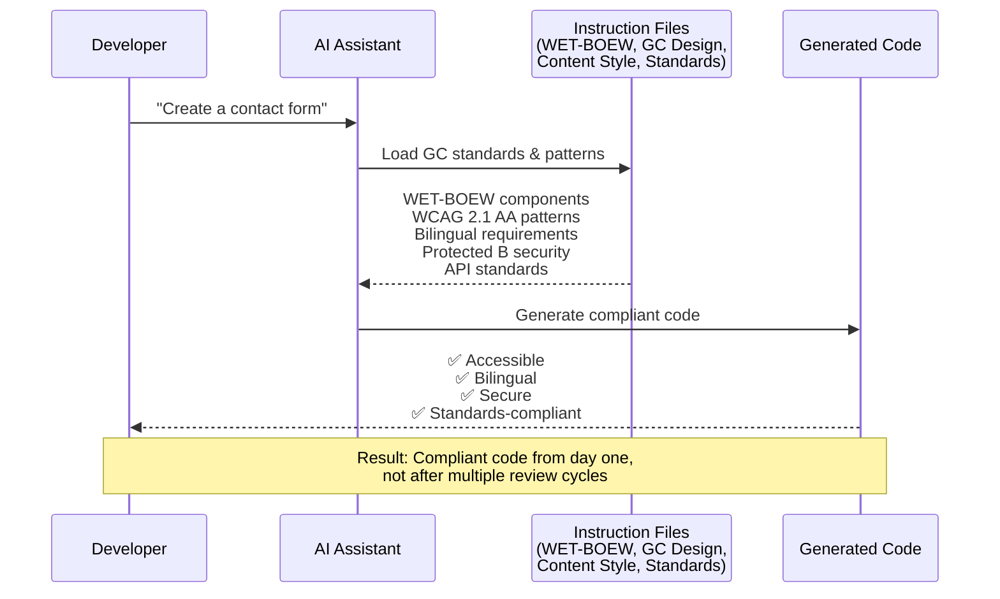

+++
title = "Why Canada's Digital Government Infrastructure Is Perfect for AI-Assisted Development"
date = "2026-02-11"
draft = true
description = "Canada's WET-BOEW toolkit, GC Design System, Content Style Guide, and Digital Standards create the perfect ecosystem for AI-assisted government software development"
category = "government"
tags = ["government", "ai", "accessibility", "standards", "web-development", "content-design"]
image = "/images/canadian-government-platforms.jpg"
mermaid = true
toc = true
+++

Picture this: You just won a contract to build a web application for the Government of Canada. Exciting, right? Then reality hits.

You need WCAG 2.1 AA accessibility compliance—not as an afterthought, but baked into every component. The entire application must work flawlessly in both English and French. You'll need to navigate the Standard on Web Accessibility, understand Protected B data classification, and ensure your code can pass security review and Threat and Risk Assessment (TRA). Oh, and your fixed-price contract means every hour spent figuring out "how things are done around here" cuts directly into your margins.

You open the Web Experience Toolkit (WET-BOEW) documentation, the GC Design System guide, the Canada.ca Content Style Guide, and the Digital Standards page. It's overwhelming. Where do you even start?

Here's what most contractors don't realize: **Canada has already built the infrastructure that makes AI coding assistants incredibly effective.** The same standards and toolkits that seem daunting at first are exactly what AI assistants need to help you build compliant government applications faster than you thought possible.

## What Makes AI Coding Assistants Effective?

Before we dive into Canada's digital ecosystem, let's talk about what AI assistants actually need to be useful—especially in constrained, regulated environments like government software development.

**AI coding assistants work best when they have structured context, not just raw code.** They need:

1. **Bounded vocabulary**: A limited, well-defined set of components and patterns rather than infinite possibilities
2. **Predictable patterns**: Clear conventions for how things should be done
3. **Explicit guardrails**: Institutional knowledge encoded as machine-readable guidance

Think about it: When you ask an AI assistant to "build a contact form," it could generate thousands of different implementations. But when you ask it to "build a WET-BOEW compliant contact form for a Government of Canada website," suddenly there's structure. There's a right way to do it. The assistant can reference actual components, follow established accessibility patterns, and ensure bilingual support—because those constraints are part of the platform.

The key is encoding institutional knowledge as a platform knowledge infrastructure:

**Platform knowledge layer**: The institutional knowledge about how to build things the "right way"—encoded as AI instruction files. This includes WET-BOEW components, GC Design System patterns, Content Style Guide conventions, API standards, accessibility requirements, and security patterns for Protected B data.

(The underlying cloud infrastructure and deployment operations are important topics, but they come into play later in the development lifecycle. For now, let's focus on what you need to build compliant government applications.)

The breakthrough is encoding platform knowledge as machine-readable instruction files that AI assistants can automatically apply.

Here's the insight that changed my perspective: **Canada has been building this ecosystem for over a decade, since WET-BOEW launched in 2010.** We just haven't optimized it for AI consumption yet.

## Canada's Digital Government Ecosystem

The Government of Canada's digital infrastructure is delivered by several key **platform providers**—organizations that create and maintain the standards, frameworks, and services that enable compliant digital service delivery.

```mermaid
graph TB
    subgraph DC["design.canada.ca<br/><i>(Treasury Board Secretariat)</i>"]
        WET[WET-BOEW<br/>Accessible Components]
        CSG[Content Style Guide<br/>Writing Standards]
        DS[Digital Standards<br/>Design Principles]
        API[Standards on APIs<br/>Technical Specs]
    end

    subgraph CDS["digital.canada.ca<br/><i>(Canadian Digital Service)</i>"]
        GCDS[GC Design System<br/>Design Tokens & Templates]
        GCN[GC Notify<br/>GC Forms<br/>GC Sign-in<br/>GC Issue & Verify]
        SDK[Service Digital Toolkit]
    end

    subgraph TB["Translation Bureau"]
        TERM[TERMIUM Plus<br/>Official Terminology]
        GCT[GCtranslate<br/>AI Translation]
    end

    subgraph CCCS["Canadian Centre for Cyber Security"]
        ITSG[ITSG-33<br/>Security Controls]
        CMVP[CMVP<br/>Cryptographic Validation]
    end

    WET --> AI[AI-Assisted Development<br/>Fast, Compliant, Accessible]
    CSG --> AI
    DS --> AI
    API --> AI
    GCDS --> AI
    GCN --> AI
    SDK --> AI
    TERM --> AI
    GCT --> AI
    ITSG --> AI
    CMVP --> AI

    style AI fill:#90EE90
    style DC fill:#E8F4F8
    style CDS fill:#E8F4F8
    style TB fill:#FFE8E8
    style CCCS fill:#FFE8E8
```



### The Platform Providers

These organizations provide the standards, frameworks, tools, and services that make building compliant Government of Canada digital services possible. Each contributes essential resources that provide the bounded vocabulary, predictable patterns, and explicit guardrails that make AI-assisted development effective.

#### 1. design.canada.ca (Treasury Board Secretariat)

[design.canada.ca](https://design.canada.ca/) is the official source for Canada.ca design patterns, content standards, and web development guidance. Maintained by the Treasury Board of Canada Secretariat, it provides the foundational standards and frameworks that define how Government of Canada digital services should be built.

**What design.canada.ca provides:**

**Web Experience Toolkit (WET-BOEW)**: An open-source code library for building accessible, usable, interoperable government websites. It's been the standard for federal web presence since 2010, which means there's over 15 years of institutional knowledge embedded in its patterns.
- **WCAG 2.1 AA compliance is built-in**: Components are already compliant
- **Reusable components with clear APIs**: Date pickers, form validation, multimedia players—all documented and tested
- **WAI-ARIA support**: Screen reader compatibility built-in
- **Open source on GitHub**: AI assistants can learn from actual implementations

**Canada.ca Content Style Guide**: The [Content Style Guide](https://design.canada.ca/style-guide/) provides writing and content standards for all Government of Canada web content. Recently updated to align with ISO plain language standards.
- **Plain language principles**: Clear, simple writing that citizens can understand
- **Structured content patterns**: Standard formats for headings, lists, tables, and links
- **Tone and voice guidance**: How to write in a consistent, citizen-centered way
- **Bilingual writing conventions**: Patterns for presenting both official languages
- **Bounded vocabulary for content creation**: AI assistants can draft Canada.ca-compliant content that's automatically plain language, properly formatted, and bilingual-ready

**Digital Standards**: The [10 Digital Standards](https://www.canada.ca/en/government/system/digital-government/government-canada-digital-standards.html) are the philosophical foundation—the principles that guide how digital services should be built:
- **Design with Users** (#1): Put user needs first
- **Work in the Open by Default** (#3): Share code, plans, and research
- **Build in Accessibility from the Start** (#6): Not as a retrofit
- **Design Ethical Services** (#9): Consider the broader impact
- **Collaborate Widely** (#10): Work across organizational boundaries

**Standards on APIs**: The [Standards on APIs](https://www.canada.ca/en/government/system/digital-government/digital-government-innovations/government-canada-standards-apis.html) provide technical requirements for building Government of Canada APIs:
- **Architecture**: RESTful model by default, JSON message format (UTF-8), resource-oriented URLs
- **Security**: TLS 1.2+, JWT authentication, API keys in headers (never URLs)
- **Data Standards**: ISO 8601 datetime format in UTC, JSON responses as objects (not arrays)
- **Versioning**: Format `v<Major>.<Minor>.<Patch>`, major version in URL (e.g., `/v3/`)
- **Error Handling**: HTTP status codes, abstract internal details, consistent error format
- **Performance**: Pagination required, restrict wildcard queries, published benchmarks
- **Documentation**: OpenAPI specifications, published to API Store

**Why design.canada.ca matters for AI assistants**: These standards provide the bounded vocabulary (WET-BOEW components), predictable patterns (Content Style Guide conventions), and explicit guardrails (Digital Standards principles) that make AI-assisted development effective. An AI assistant with design.canada.ca context generates code that's accessible, bilingual, and compliant from the start.

#### 2. digital.canada.ca (Canadian Digital Service)

The [Canadian Digital Service (CDS)](https://digital.canada.ca/) is an organization within the Treasury Board of Canada Secretariat that builds and operates modern digital tools for government. CDS provides reusable platform services and design systems that help departments deliver better citizen experiences.

**What digital.canada.ca provides:**

**GC Design System**: The [GC Design System](https://design-system.canada.ca/) is CDS's design language for government services:
- **Pre-built page templates**: Landing pages, service initiation flows, confirmation pages—all following Canada.ca patterns
- **Design tokens**: Standardized colors, spacing, typography (not arbitrary values)
- **Component library**: Breadcrumbs, buttons, cards, forms, navigation—all consistent with the broader Canada.ca experience
- **CSS utility classes**: A consistent styling vocabulary that speeds up development
- **Bilingual support built into the core**: Not bolted on, but fundamental to every component

**Why this matters for AI assistants**: The GC Design System provides predictable patterns—established conventions that eliminate arbitrary design decisions. AI assistants can reference design tokens, page templates, and utility classes to generate consistent, Canada.ca-compliant interfaces automatically.

**GC Notify**: A [free notification service](https://notification.canada.ca/) for sending emails and SMS. GC Notify provides departments with a standardized API for sending up to 20 million emails and 100,000 texts per year, with bilingual defaults and Federal Identity Program compliance built-in.

**GC Forms**: A [platform for building accessible, bilingual forms](https://articles.alpha.canada.ca/forms-formulaires/) without custom development. It standardizes the form-building process across departments.

**GC Sign-in**: The next-generation [authentication service](https://digital.canada.ca/2025/02/12/streamlining-government-services-introducing-gc-sign-in/) (piloting in 2025) that modernizes citizen login with passwordless authentication, passkeys, and self-serve integration tools—addressing the current complexity of 270+ online services with 60+ different sign-in methods.

**GC Issue and Verify**: An upcoming digital credentials service that will enable departments to issue and verify digital credentials securely—supporting use cases like digital licenses, certificates, and other government-issued credentials that citizens can store and present digitally.

**Service Digital Toolkit**: A [collection of practical resources](https://digital.canada.ca/service-digital-toolkit/), templates, and guidance for designing and delivering digital services. This toolkit helps teams translate the high-level Digital Standards into concrete practices and workflows.

**Why digital.canada.ca matters for AI assistants**: CDS provides a bounded vocabulary of reusable services. Instead of building custom notification systems, authentication flows, or form builders, developers integrate standardized services with clear APIs—exactly the kind of structure AI assistants excel at generating integration code for.

#### 3. Translation Bureau

The [Translation Bureau](https://www.canada.ca/en/translation-bureau.html) provides linguistic services across 101 languages, ensuring consistent bilingual communication across government.

**What the Translation Bureau provides:**

**TERMIUM Plus®**: [TERMIUM Plus](https://www.btb.termiumplus.gc.ca/tpv2alpha/alpha-eng.html?lang=eng) is one of the world's largest terminology databases with millions of terms in English, French, Spanish, and Portuguese. It provides:
- **Official government terminology**: Authoritative translations for government terms
- **Standardized vocabulary**: Consistent terminology across the federal public service
- **Domain-specific terms**: Technical, legal, and administrative terminology

**GCtranslate**: An [AI-powered translation service](https://www.canada.ca/en/public-services-procurement/news/2025/09/gctranslate-using-artificial-intelligence-to-build-a-more-agile-modern-and-bilingual-public-service.html) for government content up to Protected B, demonstrating the government's successful use of AI for bilingual content creation.

**Why the Translation Bureau matters for AI assistants**: TERMIUM Plus provides **official government terminology** as a bounded vocabulary for bilingual translation. Instead of AI assistants guessing at French translations or using inconsistent terminology, they can reference the authoritative database that standardizes terms across the federal public service.

#### 4. Canadian Centre for Cyber Security (CCCS)

The [Canadian Centre for Cyber Security (CCCS)](https://www.cyber.gc.ca/en/government-institutions) provides security frameworks and guidance for government IT systems.

**What CCCS provides:**

**ITSG-33**: The [IT Security Risk Management framework](https://www.cyber.gc.ca/en/guidance/it-security-risk-management-lifecycle-approach-itsg-33) provides detailed security controls:
- Access controls and session management
- Audit logging requirements
- Encryption standards
- Data protection measures

**Cryptographic Module Validation Program (CMVP)**: [Certification program](https://www.cyber.gc.ca/en/cryptographic-module-validation-program) for encryption products used in government systems.

**Why CCCS matters for AI assistants**: CCCS guidance provides authoritative security patterns for application code. Instead of developers guessing at encryption requirements, instruction files can encode CCCS-approved approaches (e.g., "Use CMVP-validated encryption for Protected B data" or "Follow ITSG-33 AC-2 access control patterns in authentication code").

### The Ecosystem Working Together

These platform providers work together to create a comprehensive digital ecosystem for government. **design.canada.ca** provides the foundational standards and frameworks. **digital.canada.ca (CDS)** delivers modern platform services and design systems. The **Translation Bureau** ensures consistent bilingual terminology. **CCCS** provides security frameworks for protecting government systems and data.

These organizations weren't built with AI assistants in mind. But they provide exactly the structure AI assistants need: **bounded vocabulary** (WET-BOEW components for UI, Content Style Guide conventions for writing, TERMIUM Plus terminology for bilingual translation), **predictable patterns** (GC Design System tokens and templates for design consistency, Standards on APIs for technical specifications), and **explicit guardrails** (Digital Standards principles, ITSG-33 security controls, WCAG 2.1 AA requirements).

Here's how this ecosystem enables AI-assisted development in practice:



When a developer asks their AI assistant to build a Government of Canada contact form, the assistant can reference the entire ecosystem—WET-BOEW components for accessible UI, Content Style Guide patterns for plain language labels, TERMIUM Plus for official bilingual terminology, Standards on APIs for backend endpoints, and ITSG-33 controls for Protected B data handling. The result is compliant code from the start, not after multiple review cycles.

**Let's examine how each platform provider contributes to effective AI assistance. Then we'll tackle a critical question: if these resources are so valuable, why do developers struggle to find and use them?**

## How WET-BOEW Provides "Bounded Vocabulary" for Components

Let's talk about the first requirement for effective AI assistance: **bounded vocabulary**.

In software development, "unbounded vocabulary" means infinite ways to solve a problem. An AI assistant asked to "create an accessible date picker" has to make countless assumptions about accessibility, bilingual support, and keyboard navigation.

**Bounded vocabulary** means a limited, well-defined set of solutions. WET-BOEW provides this through its component library.

When you ask an AI assistant to "create an accessible bilingual date picker for a Government of Canada form" with WET-BOEW context, it generates:

```html
<div class="form-group">
    <label for="date-birth">
        <span class="field-name">Date of birth</span>
        <span lang="fr">Date de naissance</span>
        <strong class="required">(required)</strong>
    </label>
    <input
        class="form-control"
        id="date-birth"
        name="date-birth"
        type="date"
        data-rule-required="true"
        data-msg-required="This field is required."
        data-msg-required-fr="Ce champ est obligatoire."
    />
</div>
```

The bounded vocabulary of WET-BOEW components eliminates ambiguity. The AI assistant knows to use `form-group` wrappers, bilingual labels with `lang` attributes, WET-BOEW validation data attributes, and Canada.ca styling patterns.

When you use WET-BOEW components, WCAG 2.1 AA compliance isn't something you achieve—it's something you inherit. Instead of "figure out how to build an accessible modal," it's "use the WET-BOEW lightbox component."

**See comprehensive examples**: [forms.instructions.md](/gc-ai-instructions/wet-boew/forms.instructions.md), [alerts.instructions.md](/gc-ai-instructions/wet-boew/alerts.instructions.md), [tables.instructions.md](/gc-ai-instructions/wet-boew/tables.instructions.md)

## How the Content Style Guide Provides "Bounded Vocabulary" for Content

The **Canada.ca Content Style Guide** provides structured patterns for writing web content—turning the infinite possibilities of how to phrase something into a well-defined set of conventions.

**Without Content Style Guide context**, an AI might write:
> "Individuals who have attained the age of majority in their province or territory of residence and who are currently experiencing involuntary cessation of employment may be eligible to receive financial assistance through the Employment Insurance program..."

**With Content Style Guide context**, the AI knows Canada.ca patterns:
> "You may be eligible for Employment Insurance (EI) if you:
> - are at least 18 years old (or the age of majority in your province)
> - lost your job through no fault of your own
> - worked enough insurable hours in the past year"

The Content Style Guide provides clear rules: bullet points for eligibility criteria, second person ("you"), short sentences, acronym definitions, and front-loaded information. An AI assistant with this context automatically generates plain language, bilingual-ready content following Canada.ca patterns.

The Translation Bureau's **TERMIUM Plus®** adds another layer—official government terminology. Instead of inconsistent translations ("Assurance d'emploi" vs "Assurance contre le chômage"), the AI knows the official term is "**assurance-emploi**" and uses it consistently across all bilingual content.

**See comprehensive examples**: [bilingual.instructions.md](/gc-ai-instructions/wet-boew/bilingual.instructions.md)

## How CDS's GC Design System Provides "Predictable Patterns"

The second requirement for effective AI assistance is **predictable patterns**—established conventions that eliminate arbitrary decisions. Without standards, questions like "How much spacing between the page title and content?" have no right answer. 20 pixels? 32 pixels? 2 rem?

The GC Design System solves this with **design tokens**—standardized values for spacing, colors, and typography. Instead of guessing, an AI assistant uses the established scale:

```html
<h1 class="gc-h1">Apply for a Social Insurance Number</h1>
<div class="mt-4">  <!-- margin-top: 2rem via spacer-4 -->
    <p>A Social Insurance Number (SIN) is a nine-digit number...</p>
</div>
```

The GC Design System also provides **pre-built page templates**—complete structural patterns for common service pages (service initiation, confirmation, error pages). An AI assistant with this template context doesn't need to decide "how should a service start page be structured?"—it already knows. The pattern is predictable: 8-column main content, 4-column sidebar, standard information hierarchy (service description → eligibility → requirements → action).

**See comprehensive examples**: [utilities.instructions.md](/gc-ai-instructions/gc-design-system/utilities.instructions.md), [page-templates.instructions.md](/gc-ai-instructions/gc-design-system/page-templates.instructions.md)

## How Digital Standards Provide "Explicit Guardrails"

The third requirement for effective AI assistance is **explicit guardrails**—institutional knowledge about what should and shouldn't be done. The 10 Digital Standards aren't technical specifications—they're principles that guide decisions. But they can be encoded into instruction files that AI assistants automatically apply.

**Standard #6: Build in Accessibility from the Start** means accessibility isn't a retrofit. When you ask for a data table, an AI with this guardrail automatically includes `<caption>` elements, `scope` attributes, semantic structure (`<thead>`, `<tbody>`, `<tfoot>`), and proper heading hierarchy—WCAG 2.1 compliance built-in from the first line of code.

**Standard #5: Address Security and Privacy Risks** means the AI won't casually suggest storing Protected B data in browser localStorage or logging PII. Instead, it generates code with structured logging that excludes personal information, parameterized queries to prevent SQL injection, and safe error messages that don't expose internal details.

**Standard #9: Design Ethical Services** means the AI questions data collection. Ask it to build a form collecting demographic data, and it might respond: "Per Digital Standard #9, we should clarify: Is this information required to deliver the service? Has it been reviewed via a Privacy Impact Assessment? Will users understand why we're collecting it?"

This is the AI assistant acting as a guardrail—not just implementing what you asked, but questioning whether it aligns with ethical service design.

**See comprehensive examples**: [accessibility.instructions.md](/gc-ai-instructions/accessibility/accessibility.instructions.md), [security-protected-b.instructions.md](/gc-ai-instructions/security/security-protected-b.instructions.md)

## The Discoverability Problem: From Scattered to Buried

Canada has built an impressive digital ecosystem for government development—standards, frameworks, design systems, security guidance. But there's a fundamental problem: **developers can't find them.** This isn't just about documentation being incomplete. The official standards are scattered across multiple sites with no clear map, and departmental standards are buried in SharePoint folders that nobody can locate. Let's examine both layers of this crisis.

### Official Standards: Scattered Across Multiple Sites

Picture this scenario: You just won a contract to build a Government of Canada web application. You want to "do things the right way" and follow official standards. So you start searching.

You find:
- **https://design.canada.ca/** - "Canada.ca design system"
- **https://digital.canada.ca/** - "Canadian Digital Service"
- **https://design-system.canada.ca/** - "GC Design System"
- **https://wet-boew.github.io/** - "Web Experience Toolkit"
- **https://design.gccollab.ca/** - "GCcollab Design System"

You open several tabs. You start reading. Questions immediately arise:

#### Which Design System Do I Use?

**design.canada.ca** appears to be comprehensive. It includes:
- Canada.ca Content Style Guide
- Canada.ca design patterns
- WET-BOEW templates and components
- Content and Information Architecture Specification
- Accessibility guidance
- Template and design patterns

This looks like the official source. But then you notice **design-system.canada.ca** from the Canadian Digital Service (CDS). It has:
- A different design token system
- Different CSS utility classes
- Different component library
- Different page templates

**Which one do you use?** Are they compatible? Complementary? Competing?

You ask your tech lead. They're not sure either: "I think design.canada.ca is for the Canada.ca website itself, and the CDS design system is for... other services? Or maybe the CDS one is the new direction? Just use WET-BOEW to be safe."

#### The WET-BOEW vs. Design System Confusion

So you focus on WET-BOEW. That's clear, right? It's the standard toolkit since 2010.

But then you notice:
- **design.canada.ca** hosts WET-BOEW templates and examples
- **wet-boew.github.io** is the original WET-BOEW documentation
- Some examples on design.canada.ca look different from wet-boew.github.io examples

Are they the same? Different versions? Which documentation is authoritative?

You check the WET-BOEW GitHub repository. Last stable release: v4.0.87 (June 2024). But the design.canada.ca templates reference "WET-BOEW 4.0.x with Canada.ca theme." Is the Canada.ca theme a separate thing? Where's that documented?

#### The GCcollab Design System Nobody Mentions

Then there's **design.gccollab.ca** - a completely separate design system for GCcollab and GCconnex (internal Government of Canada collaboration platforms).

This uses different components, different styling, different patterns. It's not compatible with WET-BOEW or the CDS design system.

**But nobody mentioned this existed.** You only found it because you were doing a comprehensive search. How many contractors have accidentally tried to use GCcollab patterns for Canada.ca sites, or vice versa?

#### Scattered API Guidance

You need to build backend APIs for your application. Time to find the API standards.

You search "government of canada api standards" and find:
- **https://www.canada.ca/en/government/system/digital-government/digital-government-innovations/government-canada-standards-apis.html** - "Standards on APIs" (the official standard)
- **https://www.canada.ca/en/government/system/digital-government/digital-government-innovations/enabling-interoperability/api-guidance.html** - "API Guidance" (guidance for implementing the standard?)
- **https://api.canada.ca/** - "Government of Canada API Store" (where you publish APIs)
- Various department-specific API documentation scattered across different sites

Are these all the same thing? The first two URLs are both under "digital-government-innovations" - why are they separate pages? Does "API Guidance" supplement "Standards on APIs"? Do they contradict each other?

You read both documents. There's significant overlap, but also some differences in recommendations. Which takes precedence?

#### Multiple Entry Points, No Clear Map

Here's the fundamental problem: **There's no authoritative map of the Government of Canada digital ecosystem.**

Depending on where you enter, you get a different view:

**Entry via design.canada.ca:**
- Focus: Canada.ca website design patterns
- You learn about: WET-BOEW, Content Style Guide, IA specification
- You might miss: CDS platform services (GC Notify, GC Forms), Standards on APIs, CCCS security guidance

**Entry via digital.canada.ca:**
- Focus: CDS products and services
- You learn about: GC Design System, GC Notify, GC Forms, GC Sign-in
- You might miss: WET-BOEW details, Content Style Guide, API standards

**Entry via wet-boew.github.io:**
- Focus: WET-BOEW component library
- You learn about: Accessible components, JavaScript plugins
- You might miss: Content Style Guide, CDS services, security frameworks

**Entry via Google search "canada government web development standards":**
- You get a mix of results from all the above plus outdated blog posts, archived documentation, and provincial government sites
- Good luck figuring out what's current and authoritative

### Departmental Standards: Buried in SharePoint

If official standards are scattered across multiple sites, departmental standards are even worse—buried in SharePoint folders, outdated Word documents, and tribal knowledge that exists only in people's heads.

#### The SQL Standards Document Nobody Can Find

You start a new contract at a department. On day three, someone mentions in passing: "Oh, we have SQL coding standards. The DBAs wrote them a few years ago."

Where are they? Nobody's quite sure. You check:
- The project SharePoint (maybe in the "Archive" folder? Or was it "Documentation"?)
- The department wiki (if you can remember the URL)
- That network drive everyone shares (somewhere in `P:\IT\Database\Standards\Old\Maybe?`)
- Someone's OneDrive they shared once

You finally find a Word document: `SQL_Coding_Standards_v2_FINAL_revised_2019.docx`

You open it. It says:
- All table names must use `tbl_` prefix
- All stored procedures must use `usp_` prefix
- All column names must be PascalCase
- No use of SELECT * in production code
- All queries must be parameterized (no dynamic SQL)

**Questions immediately arise:**

1. **Is this still enforced?** The document is from 2019. Do new projects follow this?
2. **What about Entity Framework?** The standards assume raw SQL, but your project uses EF. Does that count? Can you use LINQ queries or are you supposed to write stored procedures?
3. **Do the prefixes still apply?** Modern database design typically avoids Hungarian notation prefixes. Is `tbl_` still required or is this outdated?
4. **Who enforces this?** Is there a code review checklist? Will the DBAs reject your pull request if you don't follow this?
5. **What's the penalty for non-compliance?** Is this a hard requirement or a "nice to have" guideline?

You ask the tech lead. They shrug: "I think we used to follow that, but the last project didn't. Just be consistent, I guess?"

#### Other Buried Standards

SQL isn't the only example. Common buried standards include:

**Git branching strategy**:
- Some Word doc that says "use GitFlow" but half the team uses trunk-based development
- Nobody knows if feature branches should be `feature/TICKET-123` or `feature/ticket-123` or `TICKET-123-feature`
- Unclear if you should delete branches after merging

**Code review checklist**:
- Exists somewhere, but nobody references it during reviews
- Inconsistently applied (some reviewers are strict, others rubber-stamp)
- Outdated rules (still mentions Internet Explorer 9 compatibility)

**API naming conventions**:
- RESTful endpoints should be `/api/v1/resources` but some APIs use `/services/resource`
- Query parameters: camelCase or snake_case? (Both exist in production)
- Date formats: ISO 8601 or `YYYY-MM-DD` or Unix timestamps? (All three in use)

**Database naming conventions**:
- Schema names: `dbo`, department code (`ESDC_`), or application name (`benefits_`)?
- Foreign key naming: `FK_Table1_Table2` or `fk_table1_table2_id` or `table2_id`?
- Index naming conventions exist but nobody follows them

**Security review requirements**:
- Submit threat and risk assessment (TRA) to security team (which form? where?)
- Include security controls documentation (which template? 2020 version or 2023?)
- Threat model required (what format?)

#### The Bigger Problem: Tribal Knowledge

Worse than buried standards is **tribal knowledge**—the unwritten rules that exist only in people's heads:

- "We don't actually use stored procedures anymore, even though the standard says to"
- "Ignore the tbl_ prefix rule, nobody's enforced that since 2020"
- "Always have Marie review database changes because she's the only one who understands the replication setup"
- "You can't deploy on Fridays" (learned from a production incident three years ago)
- "Use the staging environment, not the test environment—test hasn't worked since the migration"

An AI assistant has zero access to tribal knowledge. It will confidently suggest things that violate unwritten rules. You'll learn through trial and error and code review feedback—the same painful way everyone before you learned.

### Why This Matters for AI Assistants

Here's the critical insight: **If standards are hard for humans to discover and navigate, they're nearly impossible for AI assistants to understand.**

An AI assistant trying to help you build a Government of Canada application faces these challenges at both levels:

**At the official standards level:**
- **Which source is authoritative?** design.canada.ca has WET-BOEW examples, wet-boew.github.io has different ones, design-system.canada.ca has yet another approach—the AI can't know which to prioritize
- **Are resources complementary or competing?** Should you use WET-BOEW *and* the CDS Design System? Can you use GCcollab design patterns on Canada.ca sites? The AI has to guess
- **What's current vs. deprecated?** Multiple versions exist, some dated, some not—the AI can't distinguish authoritative from outdated
- **Context switching is expensive**: Building a simple GC contact form requires pulling from 5+ different documentation sources (WET-BOEW components, Content Style Guide, bilingual requirements, accessibility standards, security patterns)

**At the departmental standards level:**
- **AI can't find buried standards**: SQL standards in SharePoint, Git branching docs in Word files, security checklists on network drives—none of this is accessible to AI assistants
- **AI can't distinguish current from outdated**: Is that 2019 SQL standards document still enforced? The AI has no way to know
- **AI has zero access to tribal knowledge**: "Ignore the tbl_ prefix rule" or "use staging, not test environment"—unwritten rules don't exist for AI

The result: AI assistants generate code based on whichever documentation they found first, which may be wrong, outdated, or from the wrong design system entirely.

### The Real Cost

This discoverability crisis isn't just confusing—it's expensive at both levels:

**Official standards:**
- **Time wasted searching**: 8 hours over the first week finding and reading scattered documentation = $800/developer wasted
- **Inconsistent implementations**: Different team members find different docs and implement different patterns—code reviews become debates about which source is "correct"
- **Accessibility review failures**: Following one doc's examples fails another reviewer's requirements—rework cycles begin
- **AI makes educated guesses**: Sometimes correct, sometimes close, sometimes completely wrong (GCcollab patterns when you needed WET-BOEW)
- **Knowledge fragmentation**: Senior developers each have their own mental map built through trial and error—juniors get different advice depending on who they ask

**Departmental standards:**
- **Onboarding time**: First week figuring out "how things are done here" = $4,000/developer wasted
- **Inconsistent codebases**: Without clear standards, every developer follows their own patterns—reviews become style arguments
- **Repeated questions**: Tech leads spend hours answering "What's the branching strategy?" "Do we use tbl_ prefix?" "Is EF allowed?"
- **AI assistants can't help**: Blind to your actual standards, they generate code that doesn't match your patterns
- **Knowledge loss**: When the senior DBA who wrote those SQL standards retires, nobody knows if they were essential or cargo cult

### What We Need

Standards at both levels need to be:

1. **Findable**: Not scattered across multiple sites or buried in SharePoint—in the repository with the code
2. **Authoritative**: Clear which source is official, which resources are complementary vs. competing
3. **Current**: Version-controlled, updated when practices change, with clear deprecation markers
4. **Clear**: Explicit about what's mandatory vs. guideline
5. **Enforced**: Automated checks where possible, clear code review criteria
6. **Machine-readable**: Structured so AI assistants can apply them automatically

The Government of Canada has built an impressive digital ecosystem over 15+ years:
- ✅ Accessible component library (WET-BOEW)
- ✅ Content standards (Content Style Guide)
- ✅ Design system (GC Design System)
- ✅ Security guidance (CCCS, ITSG-33)
- ✅ API standards (Standards on APIs)
- ✅ Platform services (GC Notify, GC Forms, etc.)

**But the ecosystem lacks the information architecture and discoverability that makes these resources actually usable—for humans or AI assistants.**

This is exactly what the next section addresses.

## The Missing Piece: Machine-Readable Instructions

Here's where we get practical. Canada has all the pieces—WET-BOEW provides bounded vocabulary, the GC Design System provides predictable patterns, and the Digital Standards provide guardrails. But there's a problem:

**These resources exist as human-readable documentation, not machine-readable instruction files optimized for AI consumption.**

An AI assistant can technically read the WET-BOEW documentation on GitHub or the GC Design System website. But it's doing this on-demand, every time you ask a question, with no persistence or structure. It's like hiring a contractor who has to re-read the entire building code every time they install a light switch.

### Machine-Readable Instruction Files

The solution is to encode platform knowledge as structured instruction files that AI assistants can load automatically. An open-source template for this approach is available (MIT licensed, at [github.com/adhocteam/cloud.gov-instructions](https://github.com/adhocteam/cloud.gov-instructions)) and can be adapted for Canadian government development.

**Key patterns for effective instruction files:**

1. **Structured instruction files**: Organize platform knowledge into domain-specific instruction files (WET-BOEW, accessibility, bilingual, security, etc.) in a shared team repository
2. **Context-aware loading**: Use YAML frontmatter (`applyTo: "**/*.html"`) to automatically load relevant instructions when developers work with specific file types
3. **Safety guardrails**: Explicitly categorize operations as "always confirm," "confirm in production," or "safe to run"
4. **Automated compliance documentation**: Scan code annotations (like `/// ITSG-33: AC-2`) to generate security documentation automatically

For Canadian government development, adapt these patterns by encoding WET-BOEW component patterns, GC Design System utilities, Content Style Guide conventions, Standards on APIs requirements, and Protected B security controls.

## The Canadian Adaptation

Now let's bring this home. What would this instruction file structure look like adapted for Canadian government development?

The key is creating a **shared team-level instruction repository** that encodes Government of Canada standards, patterns, and compliance requirements. This repository becomes your team's knowledge base for building compliant government applications.

### Shared Instruction Repository Structure

```
gc-instructions/
├── README.md                             # How to use this repository
├── copilot-instructions.md              # Generic GC project template
├── AGENTS.md                             # Safety guardrails for AI assistants
└── instructions/
    ├── wet-boew/
    │   ├── base-template.instructions.md
    │   ├── forms.instructions.md
    │   ├── alerts.instructions.md
    │   ├── tables.instructions.md
    │   └── bilingual.instructions.md
    ├── security/
    │   ├── protected-b.instructions.md
    │   ├── logging.instructions.md
    │   └── session-management.instructions.md
    ├── accessibility/
    │   ├── wcag-checklist.instructions.md
    │   └── testing.instructions.md
    ├── gc-design-system/
    │   ├── utilities.instructions.md
    │   └── page-templates.instructions.md
    ├── api/
    │   └── standards.instructions.md
    └── agents/
        └── security-controls.agent.md
```

**Note on repository structure**: This example shows a standalone repository named `gc-instructions/`. The directory name and location can be adapted for your environment—Azure DevOps users might place this in a shared team repository, GitHub users might use `.github/instructions/`, GitLab users might use a different convention. The important part is the organized structure by domain (WET-BOEW, security, accessibility, etc.), not where it lives.

This becomes your team's shared knowledge base that multiple projects reference. Individual projects can then add their own project-specific `copilot-instructions.md` file that references this shared repository for local context.

Let's walk through what each of these files would contain, with concrete examples.

### 1. Safety Guardrails: AGENTS.md

This file defines safety guardrails for AI assistants—operations that should always require confirmation, operations that need confirmation in production environments, and operations that are safe to run automatically.

**Example snippet** (from `AGENTS.md`):

```markdown
# Safety Guardrails for AI Assistants

## Always Confirm Before Running

These operations can cause data loss or system damage:
- `dotnet ef database drop` - Drops database (permanent data loss)
- `git push --force` - Overwrites remote history
- `rm -rf` - Recursive file deletion
- `az group delete` - Deletes entire Azure resource group

## Confirm in Production Environments

These operations are safe in development but require approval in production:
- `dotnet ef database update` - Runs database migrations
- `git push origin main` - Pushes to main branch (may trigger CI/CD)
- `az webapp deploy` - Deploys application to Azure App Service

## Safe to Run Automatically

These read-only or development operations are safe:
- `git status` - Show repository status
- `dotnet test` - Run tests
- `az webapp log tail` - View application logs
```

This prevents AI assistants from running destructive operations without explicit user approval, while allowing safe operations to proceed automatically.

### 2. Generic Project Template: copilot-instructions.md

This file provides a template for project-specific context. Individual projects copy and customize this template to describe their specific application.

**Example snippet** (from `copilot-instructions.md`):

```markdown
# Government of Canada Web Application

This application serves Canadian citizens via the Canada.ca domain.

## Classification
- **Security**: Protected B
- **Accessibility standard**: WCAG 2.1 AA (mandatory)
- **Language requirements**: Bilingual (English/French) per Official Languages Act
- **Framework**: WET-BOEW 4.0.x with Canada.ca theme

[Key Standards, Project Stack, Important Paths, and Development Workflow sections...]
```

**Full file**: See [copilot-instructions.md](/gc-ai-instructions/.github/copilot-instructions.md)

This gives the AI assistant the fundamental context: what kind of project this is, what standards apply, and what constraints must be respected.

### 3. WET-BOEW Instructions

These files tell the AI assistant how to use WET-BOEW components correctly.

**Example snippet** (from `instructions/wet-boew/forms.instructions.md`):

```markdown
---
applyTo: "**/*.html,**/*.cshtml,**/Views/**"
---

# WET-BOEW Component Instructions

All Government of Canada web applications must use WET-BOEW for WCAG 2.1 AA compliance.

## Base Template Structure

Every HTML page must use this structure...

[Forms with Validation, Date Picker, Alerts, Tabs, Tables, Bilingual Content, Accessibility Requirements, Testing Checklist, and Common Mistakes sections...]
```

**Full file**: See [wet-boew.instructions.md](/gc-ai-instructions/.github/instructions/wet-boew.instructions.md)

These instruction files give the AI assistant concrete, copy-paste-ready examples of how to use WET-BOEW correctly. The `applyTo` frontmatter means these instructions load automatically whenever the developer is editing HTML or template files.

### 4. API Standards Instructions

When building Government of Canada applications with backend APIs, the Standards on APIs provide the technical requirements for API design.

**Example snippet** (from `instructions/api/standards.instructions.md`):

```markdown
---
applyTo: "**/Controllers/**,**/Api/**,**/*Controller.cs,**/*ApiClient.cs"
---

# REST API Design Instructions

Government of Canada APIs must follow REST principles, be well-documented, secure, and accessible.

## Government of Canada Standards on APIs

All Government of Canada APIs must comply with the **[Standards on APIs](https://www.canada.ca/en/government/system/digital-government/digital-government-innovations/government-canada-standards-apis.html)**.

**Key requirements**:

1. **Architecture**: RESTful model by default, JSON message format (UTF-8), resource-oriented URLs
2. **Security**: TLS 1.2+, JWT for authentication, API keys in headers (not URLs)
3. **Data Standards**: ISO 8601 datetime format in UTC, JSON responses as objects (not arrays)
4. **Versioning**: Format `v<Major>.<Minor>.<Patch>`, major version in URL (e.g., `/v3/`)
5. **Error Handling**: HTTP status codes, abstract internal details, consistent error format
6. **Performance**: Pagination required, restrict wildcard queries, published benchmarks
7. **Documentation**: OpenAPI specifications, published to API Store

[URL Structure, Response Format, Error Handling, Pagination, Versioning, Authentication sections...]
```

**Full file**: See [api.instructions.md](/gc-ai-instructions/.github/instructions/api.instructions.md)

This instruction file ensures that when developers build backend APIs for their GC applications (ASP.NET Core controllers, Express.js routes, etc.), the AI assistant automatically generates code that complies with the Standards on APIs. The `applyTo` frontmatter means these instructions load when working with API controllers or API client code.

### 5. Security Instructions for Protected B

This is where Canadian-specific compliance gets encoded.

**Example snippet** (from `instructions/security/protected-b.instructions.md`):

```markdown
---
applyTo: "src/**/*.cs,src/**/*.js"
---

# Protected B Data Handling Instructions

This application handles Protected B information per TBS security classification.

## What is Protected B?

Information that could cause serious injury to individuals or organizations if compromised. Examples:
- Social Insurance Numbers (SIN)
- Medical records
- Financial information
- Personal contact information combined with identifiers

## Logging Requirements

**CRITICAL**: Never log Protected B information. Use structured logging with PII redaction...

[Logging examples, Data Storage, Session Management, Access Control, Input Validation, Database Queries, Security Headers, Incident Response, Testing Checklist, and Common Mistakes sections...]
```

**Full file**: See [security-protected-b.instructions.md](/gc-ai-instructions/.github/instructions/security-protected-b.instructions.md)

This instruction file provides concrete security patterns that the AI assistant can reference when generating code. Every code example includes GC security references, making it easy for developers to understand *why* each pattern is required. The patterns follow [Canadian Centre for Cyber Security (CCCS) guidance](https://www.cyber.gc.ca/en/guidance) on cryptography (CMVP-validated encryption modules) and access controls (ITSG-33 security controls).

### 6. The Security Controls Documentation Agent

This is where automation gets powerful. Here's a Canadian-focused approach to automated security documentation:

**Example snippet** (from `instructions/agents/security-controls.agent.md`):

```markdown
# Security Controls Documentation Agent

## Purpose
Generate security controls documentation by scanning the codebase for security implementation patterns. Supports security reviews and ITSG-33 compliance documentation.

## Supported Frameworks
- **ITSG-33**: IT Security Risk Management framework controls
- **TBS Security Policy**: Treasury Board of Canada Secretariat security requirements for application code

## How It Works

### 1. Annotate Code with Security Implementation Notes

Add security control references in XML documentation comments...

[Code annotation examples, run commands, generated documentation including Security Controls Inventory, Security Implementation Summary, Threat Coverage Analysis sections, Usage Patterns, Control Reference Format, Benefits, Limitations, and Next Steps...]
```

**Full file**: See [security-controls.agent.md](/gc-ai-instructions/.github/agents/security-controls.agent.md)

This agent reduces the security documentation burden for government projects. Instead of manually writing security implementation descriptions, developers annotate their code and the AI assistant generates documentation automatically. This documentation supports security reviews and any formal security assessment processes your department uses.

## Real-World Benefits for Government Contractors

Let's get practical. What does all this actually mean for someone bidding on or delivering a Government of Canada project?

### Benefit #1: Faster Onboarding

**The old way**: New contractor joins the project. Spends the first week reading WET-BOEW documentation, GC Design System guides, ITSG-33 controls, security assessment requirements, Protected B handling procedures, and accessibility standards. Still doesn't really understand "how things are done around here."

**With AI-friendly instructions**: New contractor clones the repository, and their AI assistant already knows the project context. They ask: "Create a new page for the eligibility checker" and the AI generates a WET-BOEW template with proper bilingual structure, correct accessibility attributes, and GC Design System CSS utilities—no manual reading required. They're productive on day one.

**Time saved**: Easily 3-5 days of onboarding per developer. On a team of 5 contractors at $800/day, that's $12,000-$20,000 saved per project just in reduced ramp-up time.

### Benefit #2: Automatic Compliance

**The old way**: Developer builds a feature, submits for accessibility review, fails WCAG 2.1 AA in 15 places. Spends 2 days fixing: adding ARIA labels, fixing keyboard navigation, adjusting color contrast, adding bilingual error messages. Resubmits. Still has 3 failures. Repeat.

**With AI-friendly instructions**: AI assistant generates code with WCAG 2.1 AA patterns built-in from the start. Uses WET-BOEW components that are already compliant. Suggests proper ARIA attributes automatically. Includes bilingual error messages because that's in the instruction files.

**Result**: First accessibility review passes with minor feedback. No rework cycle.

**Time saved**: 2-3 days per feature cycle. On a 6-month project with 20 features, that's 40-60 days saved. At $800/day, that's $32,000-$48,000.

### Benefit #3: Faster Iteration

**The old way**: Product owner says "Let's add a confirmation step with a summary of what they entered." Developer spends an hour figuring out the right WET-BOEW components, another hour getting the bilingual labels right, 30 minutes ensuring keyboard navigation works, 30 minutes fixing the layout to match Canada.ca patterns. Total: 3 hours for a simple confirmation page.

**With AI-friendly instructions**: "Create a confirmation page showing the user's application summary with WET-BOEW styling." AI assistant generates the page in 2 minutes with correct structure, bilingual labels, accessible summary tables, and a Canada.ca-compliant layout. Developer reviews, makes minor adjustments. Total: 20 minutes.

**Time saved**: 2.5 hours per page. Over a project with 30 pages, that's 75 hours saved—nearly 10 full work days. At $800/day, that's $7,500.

### Benefit #4: Knowledge Distribution

**The problem**: Your senior developer who understands WET-BOEW, accessibility, and GC patterns is expensive ($1,200/day). Your junior developers ($600/day) are capable but need constant guidance on "how to do things the GC way."

**The old way**: Junior developer asks senior developer 5-10 questions per day. Senior developer spends 2 hours/day answering questions and reviewing code for GC compliance. Senior developer's productivity drops 25%.

**With AI-friendly instructions**: Junior developer's AI assistant provides GC-specific guidance automatically. "Should I use a `<div>` or `<button>` for this?" Assistant: "Use `<button>` for keyboard accessibility (WCAG 2.1 requirement)." "How do I add bilingual labels?" Assistant shows the exact pattern from the instruction file.

**Result**: Senior developer spends 30 minutes/day on guidance instead of 2 hours. Junior developer works more independently.

**Time saved**: 1.5 hours/day of senior developer time. Over a 120-day project, that's 180 hours = 22.5 days. At $1,200/day, that's $27,000 saved (plus improved senior developer utilization).

### Benefit #5: Security Guidance Built Into Development

**The old way**: Developer builds a feature, then realizes they need to handle Protected B data securely. Spends time searching ITSG-33 controls, CCCS guidance, figuring out encryption requirements, session timeouts, logging restrictions. Code gets flagged in security review for missing controls.

**With AI-friendly instructions**: AI assistant generates code with Protected B security patterns built-in from the start. Suggests parameterized queries automatically (SQL injection prevention). Includes structured logging that excludes PII. Applies appropriate session timeouts. References ITSG-33 controls in code annotations.

**Result**: Code passes security review with minimal rework. Security controls are documented as you build, not after the fact.

**Time saved**: 1-2 days per security review cycle. On a project with 3 security checkpoints, that's 3-6 days saved. At $800/day, that's $2,400-$4,800.

**Better outcome**: Security is proactive, not reactive. You're building compliant code from day one.

### Benefit #6: Consistent Code Quality

**The problem**: Team of 8 contractors over 18 months, rotating every 6 months. Coding styles vary. Some contractors use WET-BOEW patterns correctly, others invent custom solutions. Code reviews are slow because reviewers have to check for GC compliance in addition to functionality.

**With AI-friendly instructions**: All contractors' AI assistants use the same instruction files. Code generated follows consistent WET-BOEW patterns, security practices, and GC Design System conventions—regardless of who's writing it.

**Result**: Faster code reviews (less variance to check), more maintainable codebase, easier contractor transitions.

**Time saved**: Estimate 30 minutes/day on code reviews across the team. Over 300 days, that's 150 hours = 19 days. At $800/day, that's $15,200.

### Total Potential Savings

Let's add it up for a typical 6-month Government of Canada web application project:

| Benefit | Time Saved | Dollar Value (at $800/day) |
|---------|------------|----------------------------|
| Faster onboarding | 15-25 days | $12,000-$20,000 |
| Automatic compliance | 40-60 days | $32,000-$48,000 |
| Faster iteration | 10 days | $7,500 |
| Knowledge distribution | 22.5 days | $27,000 (senior dev time) |
| Security guidance built-in | 3-6 days | $2,400-$4,800 |
| Consistent code quality | 19 days | $15,200 |
| **Total** | **113-144 days** | **$110,500-$134,500** |

On a typical $500,000 contract, that's a **22-27% cost reduction** or profit margin improvement.

But the benefits aren't just financial:

- **Higher quality deliverables**: Fewer accessibility failures, better security compliance, more consistent UX
- **Happier clients**: Faster delivery, fewer rework cycles, better documentation
- **Happier developers**: Less time reading docs, more time building features, clearer guidance on "the right way"

## Caveats and Considerations

While the potential benefits of AI-assisted development for government projects are significant, there are important considerations to keep in mind.

### AI Assistants Are Tools, Not Replacements

This is critical: **You are still accountable for the code your AI assistant generates.**

AI assistants can:
- Generate boilerplate code following established patterns
- Suggest component usage based on instruction files
- Identify missing accessibility attributes
- Format bilingual content correctly
- Reference security controls in code comments

AI assistants cannot:
- Understand your users' needs (that's your job)
- Make architectural decisions without context
- Determine if a feature actually solves the problem
- Know if generated code has subtle security flaws
- Replace human code review and testing

**Always review AI-generated code.** Check for:
- Security vulnerabilities (injection attacks, XSS, CSRF)
- Logic errors (does it actually do what you need?)
- Accessibility issues (automated tools catch ~30% of WCAG issues)
- Bilingual accuracy (is the French translation correct, not just present?)
- Performance implications (is this efficient?)

Think of AI assistants as **very knowledgeable junior developers**: They know the patterns and can write syntactically correct code quickly, but they need senior review and guidance.

### Context Still Matters

Instruction files help AI assistants understand GC standards, but they don't replace understanding your specific project context.

**Unique project requirements** still need human judgment:
- Novel UX patterns that don't fit standard templates
- Complex business logic specific to your domain
- Integration with legacy systems
- Performance optimization for high-traffic services
- Custom accessibility accommodations beyond WCAG 2.1 AA

When you encounter these situations, the AI assistant can help with implementation details, but the design decisions are still yours.

### User Research Is Still Required

Digital Standard #1 is "Design with Users." AI assistants can't do user research for you.

Even if an AI assistant generates a perfectly WCAG 2.1 AA compliant, bilingual form using WET-BOEW components and GC Design System styling—**that doesn't mean users will understand it or be able to complete their task.**

You still need to:
- Conduct user research to understand needs
- Test prototypes with real users
- Iterate based on feedback
- Validate that your service is actually usable

AI assistants accelerate the **implementation** of user-centered designs, but they don't create user-centered designs.

### Keep Standards Updated

WET-BOEW, the GC Design System, and security standards evolve. Your instruction files need to evolve with them.

**Outdated instruction files** can be worse than no instructions at all—your AI assistant will confidently generate code using deprecated patterns.

Establish a maintenance schedule:
- Review instruction files quarterly
- Update when WET-BOEW releases new versions
- Revise when accessibility standards change (WCAG 2.2, for example)
- Adjust when security requirements evolve

If you're maintaining team or department-level instruction files, assign someone to keep them current.

### Government-Specific Challenges

**Security classification**: Many AI coding assistants are cloud-based (GitHub Copilot, ChatGPT, Claude). If you're working with **Protected B or higher data**, you may not be able to use these tools without violating security policy.

**Options**:
- Use cloud-based assistants in development environment with synthetic data (never paste real PII)
- Use AI assistants that run locally
- Check with your department's IT security team about approved tools

**Tool approval**: Not all AI coding assistants are on approved software lists. Check with your department's IT security team before using any AI tool.

### Ethical Considerations

Using AI assistants in government software development raises ethical questions:

**Accountability**: If AI-generated code has a bug that affects citizens, who's responsible? (Answer: You are. Always.)

**Bias**: AI models are trained on existing code, which may contain biases. Be especially careful when AI assistants generate:
- Language detection algorithms (might not handle Indigenous languages)
- Name validation (might reject non-Western name formats)
- Address validation (might not handle Canadian address diversity)

**Transparency**: Should citizens know that AI assistants helped build their government services? How do we communicate this? There's no clear answer yet, but it's worth discussing with your team.

**Job impact**: Will AI assistants reduce the need for junior developers? How do we ensure opportunities for career growth? These are industry-wide questions, but they matter in government too.

Per Digital Standard #9 (Design Ethical Services), these considerations should be part of your project planning.

## What About Infrastructure and Deployment?

You might be wondering: "What about deploying these applications? What about cloud infrastructure, CI/CD pipelines, monitoring?"

Those are important topics! But they typically come into play later in the development lifecycle, often handled by operations teams or during final deployment phases.

For contractors focused on application development, the immediate needs are:
- Building accessible, bilingual interfaces (WET-BOEW, GC Design System)
- Writing compliant content (Content Style Guide)
- Creating secure APIs (Standards on APIs)
- Handling Protected B data correctly in code (CCCS guidance, ITSG-33 controls)

Infrastructure and deployment patterns (cloud providers, CI/CD, monitoring, security infrastructure) are worthy of a separate discussion—perhaps a follow-up post for those interested in the full stack from development to production.

For now, let's focus on what you need to build great government applications.

## Conclusion: Canada Is Ahead of the Curve (We Just Need to Realize It)

Here's the key insight: **Canada didn't build its digital government infrastructure for AI assistants—but it turns out this is exactly what AI assistants need to excel.**

For over 15 years, the Government of Canada has been building a comprehensive platform provider ecosystem that creates effective AI assistance:

### The Platform Providers

✅ **design.canada.ca (Treasury Board Secretariat)**: The foundational standards and frameworks
  - **WET-BOEW**: Bounded vocabulary for accessible, bilingual UI components
  - **Canada.ca Content Style Guide**: Bounded vocabulary for plain language, citizen-centered content
  - **Digital Standards**: Explicit guardrails for ethical, accessible, secure service design
  - **Standards on APIs**: Technical specifications for consistent API design

✅ **digital.canada.ca (Canadian Digital Service)**: Modern platform services and design systems
  - **GC Design System**: Predictable patterns through design tokens, templates, and utilities
  - **GC Notify**: Standardized notification service
  - **GC Forms**: Accessible, bilingual form-building platform
  - **GC Sign-in**: Next-generation authentication service
  - **GC Issue and Verify**: Digital credentials service
  - **Service Digital Toolkit**: Practical guidance for implementing Digital Standards

✅ **Translation Bureau**: Official terminology and AI-powered translation
  - **TERMIUM Plus®**: Official terminology database
  - **GCtranslate**: AI-powered translation service

✅ **Canadian Centre for Cyber Security (CCCS)**: Security frameworks and guidance
  - **ITSG-33**: IT Security Risk Management framework
  - **CMVP**: Cryptographic Module Validation Program

Other countries are scrambling to figure out how to make AI coding assistants work in government. Canada already has the pieces—we just need to make them machine-readable.

### The Opportunity

By adding **machine-readable instruction files** to Canada's mature digital ecosystem, developers can dramatically improve their productivity on government projects.

Imagine:
- Onboarding to new GC projects in hours instead of weeks
- Security patterns built into code from day one, not added during security reviews
- Accessibility compliance is the default, not a struggle
- Getting GC-standards guidance from AI assistants as you code
- Delivering Canada.ca services faster with higher quality

This isn't science fiction. This pattern is already being used successfully and is ready to be adapted for Canadian context.

### The Path Forward

The opportunity is clear: Canada's digital government infrastructure—built over 15+ years—provides exactly the structured context that makes AI assistants effective. By encoding this knowledge as machine-readable instruction files, we can transform how government applications are built.

**What this could enable:**
- **Faster onboarding**: New developers productive from day one with GC-compliant code patterns
- **Built-in compliance**: Accessibility, security, and bilingual requirements encoded from the start
- **Knowledge preservation**: Institutional knowledge captured in version-controlled files, not buried in SharePoint
- **Consistent quality**: Standard patterns applied automatically across teams and projects

**Key components of this approach:**
- **Shared instruction repositories**: Team-level knowledge bases encoding WET-BOEW patterns, accessibility requirements, security controls, and bilingual conventions
- **Safety guardrails**: Clear rules about what AI assistants can do automatically versus what requires human approval
- **Security documentation**: Automated generation of compliance documentation from code annotations
- **Platform knowledge**: Government standards (design.canada.ca, digital.canada.ca, TERMIUM Plus, CCCS) encoded as reusable patterns

### Final Thought

The future of government software development isn't about AI replacing developers—it's about developers and AI working together within well-designed, standards-based platforms.

Canada already has those platforms. We built them over 15 years, one component at a time, one standard at a time. The next step is making this knowledge machine-readable so AI assistants can help developers build compliant government applications faster and with higher quality.

---

## Your Turn

Have you worked on Government of Canada projects? What patterns would you add to GC instruction files? Have you tried using AI assistants for WET-BOEW or accessibility compliance?

I'd love to hear your experiences. Drop a comment below or reach out—let's build this together.

---

*This post was inspired by Ad Hoc's excellent article "[How government platforms can make AI coding assistants more effective](https://adhoc.team/2025/01/14/ai-coding-instructions/)" and their open-source [cloud.gov-instructions repository](https://github.com/adhocteam/cloud.gov-instructions). Thanks to the Ad Hoc team for showing what's possible.*
