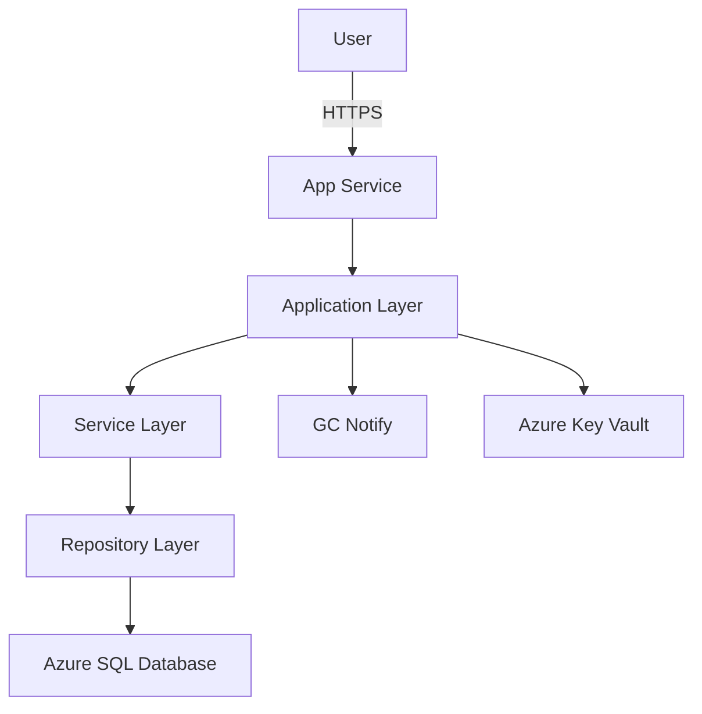

# Documentation Agent

## Purpose
Automatically generate and maintain project documentation from code, keeping docs in sync with implementation.

## Capabilities
- Generate API documentation from OpenAPI/Swagger specs
- Create README files from project structure
- Generate deployment guides
- Create changelogs from git history
- Update inline documentation
- Generate architecture diagrams (mermaid)

## How It Works

### 1. Generate API Documentation

```bash
@documentation generate-api --swagger swagger.json --output docs/api/
```

**Generates**:
```markdown
# Benefits Application API

## Endpoints

### POST /api/v1/applications
Create a new benefit application.

**Request Body**:
\```json
{
  "firstName": "string",
  "lastName": "string",
  "email": "string",
  "sin": "XXX-XXX-XXX"
}
\```

**Response**: `201 Created`
\```json
{
  "id": 12345,
  "confirmationNumber": "APP-67890",
  "submissionDate": "2025-02-11T14:30:00Z"
}
\```

**Errors**:
- `400 Bad Request`: Invalid input data
- `401 Unauthorized`: Authentication required
```

### 2. Generate README

```bash
@documentation generate-readme --analyze-structure --output README.md
```

**Generates**:
```markdown
# Benefits Application

Government of Canada Employment Insurance benefits application system.

## Features
- ✅ WET-BOEW 4.0 accessibility compliance
- ✅ Bilingual (English/French)
- ✅ Protected B data handling
- ✅ GC Notify integration

## Quick Start

\```bash
# Install dependencies
dotnet restore

# Run database migrations
dotnet ef database update

# Start application
dotnet run
\```

## Architecture
[Generated from code structure]

## API Documentation
See [API.md](docs/API.md)

## Deployment
See [DEPLOYMENT.md](docs/DEPLOYMENT.md)
```

### 3. Generate Changelog

```bash
@documentation generate-changelog --from v1.0.0 --to v1.1.0 --output CHANGELOG.md
```

**Generates**:
```markdown
# Changelog

## [1.1.0] - 2025-02-11

### Added
- GC Notify integration for email notifications
- Two-factor authentication
- Application status tracking

### Changed
- Upgraded to .NET 8.0
- Improved form validation

### Fixed
- Accessibility issues on confirmation page
- French translation errors

### Security
- Implemented rate limiting
- Added CSRF protection
```

### 4. Update Code Comments

```bash
@documentation update-comments --file ApplicationService.cs
```

**Before**:
```csharp
public async Task<Application> CreateApplication(CreateApplicationDto dto)
{
    // TODO: Add comments
}
```

**After**:
```csharp
/// <summary>
/// Creates a new benefit application.
/// </summary>
/// <param name="dto">The application data</param>
/// <returns>The created application with ID and confirmation number</returns>
/// <exception cref="ValidationException">Thrown when validation fails</exception>
public async Task<Application> CreateApplication(CreateApplicationDto dto)
{
    // Validate input data
    ValidateApplication(dto);

    // Create application entity
    var application = MapToEntity(dto);

    // Save to database
    await _repository.CreateAsync(application);

    return application;
}
```

### 5. Generate Architecture Diagram

```bash
@documentation generate-diagram --type architecture --output docs/architecture.md
```

**Generates Mermaid diagram**:


## Usage Patterns

**Generate all documentation**:
```bash
@documentation generate-all --project BenefitsApp.csproj
```

**Update existing docs**:
```bash
@documentation update --check-outdated
```

**Generate deployment guide**:
```bash
@documentation generate-deployment --environment production
```

**Create API client examples**:
```bash
@documentation generate-examples --language csharp --output docs/examples/
```

## Configuration

```json
{
  "documentation": {
    "includePrivateMembers": false,
    "generateExamples": true,
    "markdownStyle": "github",
    "updateFrequency": "on-commit",
    "outputs": [
      "docs/api/",
      "docs/guides/",
      "README.md"
    ]
  }
}
```

## Benefits

- **Always up-to-date**: Docs generated from code
- **Consistency**: Same format across projects
- **Time savings**: Automated documentation generation
- **Better onboarding**: Clear, comprehensive docs
- **API discoverability**: Interactive API documentation

## Limitations

- Cannot document business logic reasoning
- Requires well-structured code
- May need manual refinement
- Cannot replace user-facing documentation
- Human review still required

Last updated: 2025-02-11
